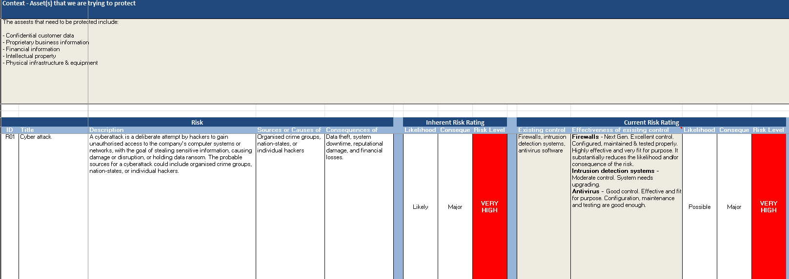
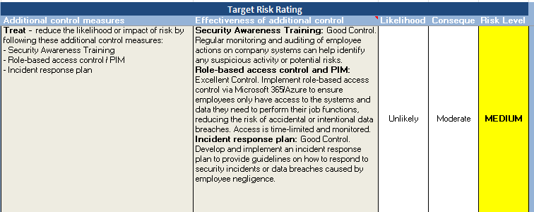

# Risk assessment

As part of the fantastic Forage job simulation, I was tasked with creating a risk assessment to improve organisation's security posture.
<h1>Scenario:</h1>
 
Conduct a comprehensive risk assessment for the client. The client has a fence around the perimeter of its property and a padlock on its entrance gate to prevent unauthorised access. However, the leadership team is concerned about potential risks and vulnerabilities that could compromise the security of its information and systems. They require a comprehensive risk assessment to identify potential security threats and vulnerabilities in their system or network.
During the risk assessment, you will need to identify the assets that need to be protected, define the risk matrix and identify potential risk scenarios. You will assess the risk ratings for each scenario, both with and without existing measures in place. Finally, you will provide a risk assessment report to the client summarising your findings and recommendations for mitigating risks and improving the institution's security posture.

<h2>Risk Assessment and recommendations for mitigating risks</h2>

 

 

 

 

 

 

 

 

 

 

 

 

Hope you enjoyed the walkthrough of the project!

